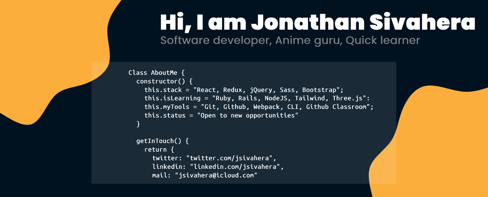

## Hi there 👋

 

### More about me:

- 🚀 I am a React lover, an Anime fan, love to listen and learn
- 👀 I am interested in learning new things
- 🌱 I am available for hire
- 📫 My mail is [jsivahera@icloud.com](jsivahera@icloud.com)

---

### My Profile in numbers:

  
Most Used Languages

  

 
  

  
Jonathan's Github Stats

  

---

### Latest Blog Posts
<!-- BLOG-POST-LIST:START -->
- [Hello World!](https://dev.to/jssol/hello-world-4o12)
<!-- BLOG-POST-LIST:END -->
